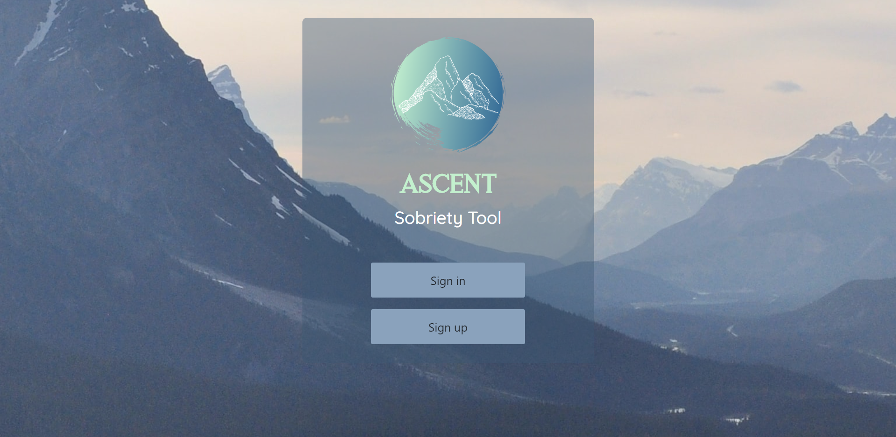
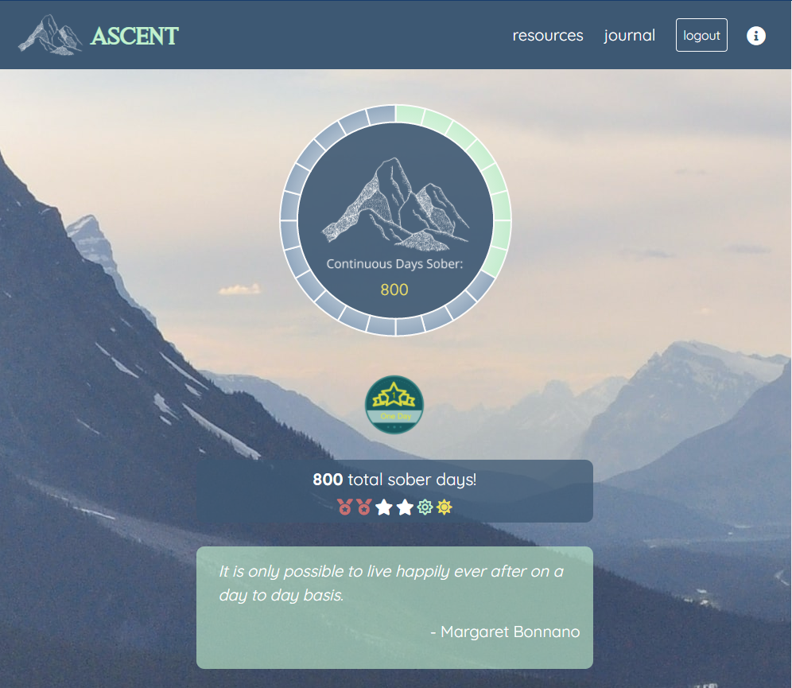
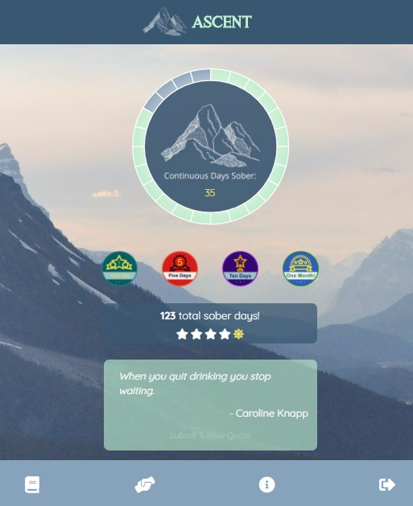
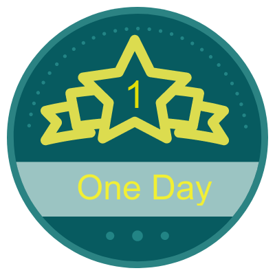
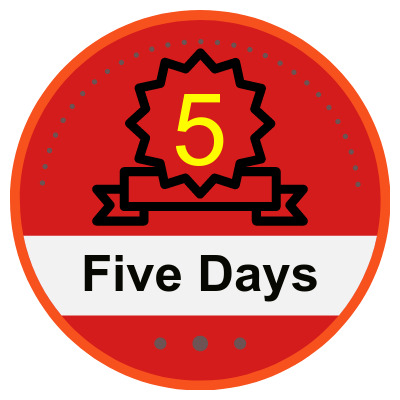
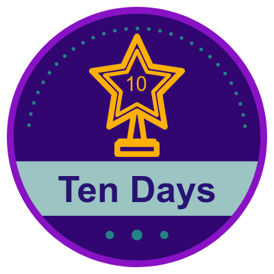
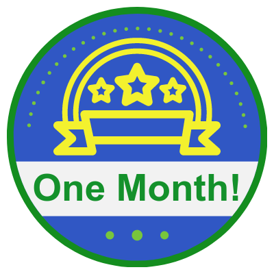
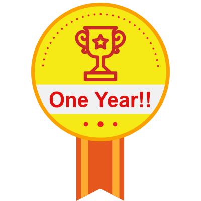

# Ascent Sobriety Tool

Ascent is a sobriety tool that helps members track their daily mood & thoughts as well as various lengths of sobriety. In a time where more and more people are living sober lifestyles, this app caters to those who are seeking to track continuous time as well as discontinuous time.

    
#### Deployed Link: [check us out on heroku!](https://ascent-sobriety.herokuapp.com/)

---

#### Table of Contents
- [Ascent](#ascent)
      - [Deployed Link: check us out on heroku!](#deployed-link-check-us-out-on-heroku)
      - [Table of Contents](#table-of-contents)
  - [Our Team:](#our-team)
  - [Description](#description)
    - [Daily Check In](#daily-check-in)
    - [Time Tracking](#time-tracking)
    - [Demo](#demo)
    - [Technologies Used](#technologies-used)
    - [Contributing](#contributing)
      - [License](#license)

---

## Our Team:

This was a joint project between the following developers listed below along with their respective github accounts.

> Rachel Campbell: [@relizabet](https://github.com/relizabet)

> Molly Kizer: [@LivesInRoom29](https://github.com/LivesInRoom29)

> Marc Langlois: [@mlanglois333](https://github.com/mlanglois333)

> Reed Santos: [@Reedsantos](https://github.com/Reedsantos)

> Keith Tharp: [@keitharp](https://github.com/keitharp)

> Aiden Threadgoode: [@a-thread](https://github.com/a-thread)

## Description

**Ascent is a sobriety tool** that helps members track their daily mood & thoughts as well as various lengths of sobriety. In a time where more and more people are living sober lifestyles, this app caters to those who are seeking to track continuous time as well as discontinuous time.

For many, sobriety is nonlinear, and to think of it as such, can be detrimental to long-term growth. By facilitating daily reflection, Ascent is creating space for each member to process and reflect on thier emotions rather than turning to substance misuse to mask or bury feelings.

By tracking continuous AND discontinuous time, Ascent opens the door to anyone seeking to live a sober lifestyle. For members, this can also mean the difference between a hiccup and an overdose. We could all use a little grace right now and with Ascent, we get that.

### Daily Check In

Every day the member checks into the app, they are met with our check in page. Here they can choose their mood on a scale of 1 to 5, write a blurb about their day and check off whether the day was a sober day. Afterwards, they are redirected to the home page showing their time in various lengths.

### Time Tracking

On the homepage, a counter displays how many hours are left in the day in the form of a donut chart with the number of continuous days sober in the inside of the counter.

Below the counter are badges earned. Badges can be earned for continuous sobriety for:
* One day: 
* Five days: 
* Ten days: 
* One month: 
* One year: 

Below that the total sober days is displayed with both the number and symbols for days, months, and years:
* One day: 
* One week: 
* One month: 
* One year: 

The display of both continuous and discontinuous data honors the member's sobriety journey whether they have hiccups along the way or not. Non-sober days impact the continuous days, but they don't restart one's entire journey.

The last element on the home page is an inspirational quote and an option to submit a quote (for review) to add to the Sobriety Quotes API.

### Demo

> Want to see more? [Explore for yourself!](https://ascent-sobriety.herokuapp.com/)

### Technologies Used
- [Express](https://expressjs.com/)
- [Sequelize](https://sequelize.org/)
- [MySQL](https://www.mysql.com/)
- [CORS](https://www.npmjs.com/package/cors)
- [Nodemailer](https://nodemailer.com/about/)
- [Passport](http://www.passportjs.org/)
- [Express-Handlebars](https://www.npmjs.com/package/express-handlebars)
- [Moment](https://momentjs.com/)
- [ApexCharts](https://apexcharts.com/)
- [Bootstrap](https://getbootstrap.com/)
- [Canva](https://www.canva.com/)
- [Frontify](https://www.frontify.com/en/)

### Contributing
If you'd like to contribute to this application, feel free to submit a pull request.

#### License
This project is licensed under GPL v3.0.

*© 2020 Dry Coders*
